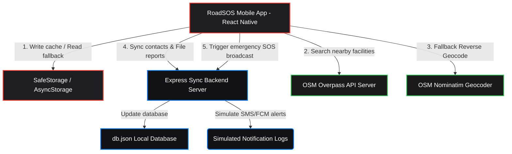

# 🚨 RoadSOS - Advanced Emergency Tracker & Safety Dashboard

RoadSOS is a high-fidelity, premium offline-first emergency tracking and safety dashboard application. Designed for react-native, mobile web, and offline conditions, it empowers users with live GPS telemetry, real-time safety facility searching, inactivity monitoring, and instant emergency broadcasts (SMS and Push Notifications).

---

## 📋 Table of Contents
1. [Core Features](#-core-features)
2. [Technology Stack](#-technology-stack)
3. [System Architecture](#-system-architecture)
4. [File & Directory Structure](#-file--directory-structure)
5. [Getting Started & Setup](#-getting-started--setup)
   - [Backend Server Setup](#1-backend-server-setup)
   - [Mobile Client Setup](#2-mobile-client-setup)
6. [API Endpoint Reference](#-api-endpoint-reference)
7. [Inactivity Safety Protocol](#-inactivity-safety-protocol)
8. [Offline-First Architecture](#-offline-first-architecture)

---

## 🌟 Core Features

### 📡 1. The Cockpit (Live Telemetry & Map)
* **Real-time Orbit Telemetry:** Track active GPS stream status (Live vs. Static), latitude, longitude, and accuracy levels.
* **Interactive Map View:** Integrated with `react-native-maps` to render user location with a pulsing indicator, a `1500m` radius safety circle, and interactive pins for nearby emergency facilities.
* **Geocoding Engine:** Automatically resolves precise street addresses using Expo Geolocation reverse geocoding, with a fallback to the OpenStreetMap Nominatim API if offline.
* **Telemetry controls:** Manually query single satellite locks or toggle a continuous GPS tracker that runs in the background.

### 🗺️ 2. Dynamic Emergency Directory
* **OSM Overpass Integration:** Performs a wide-range `8000m` (8km) scan using OpenStreetMap Overpass servers to query active nearby services.
* **Granular Filters:** Filter resources on the fly inside the drawer sidebar, including:
  * 🏥 Hospitals & Medical Clinics
  * 🚨 Police Stations
  * 🚑 Ambulance Stations
  * ⚙️ Towing & Repair Agencies
  * 🔧 Puncture & Tyre Shops
* **Quick Actions:** Call facilities instantly (deep linking to telephone dialer) or open routing/directions in external map applications (Google Maps, Apple Maps).

### 🛡️ 3. Safety Controls & Inactivity Monitor
* **Dead Man's Switch (Inactivity Lock):** Monitors user telemetry. If enabled and the user remains stationary/inactive for the selected threshold (1, 3, 5, or 10 minutes), the app initiates a visual/audio warnings phase.
* **Emergency Override Countdown:** Offers a 15-second grace period modal. If the user does not tap "I AM SAFE", the app automatically dispatches a high-priority SOS emergency broadcast.
* **SOS Contact Manager:** Add, edit, or delete emergency contacts. Features local persistence and automatically synchronizes updates to the backend.
* **Connection Sandbox:** Configurable backend server URL with a "Test Connection" status tester, indicating offline vs. online connection health.

### ⚠️ 4. Witness Crash Reporting
* **Incident Log Board:** Display reports filed by the community (Collision, Breakdown, Medical, Obstruction) synchronized from the central backend.
* **File New Report:** Form to broadcast witnessed incidents. Captures category, description, and custom severity badges (Low, Medium, Critical) along with precise location coordinates. Works offline by caching reports locally.

### 🚨 5. Absolute SOS Portal
* **Floating SOS Button:** Accessible across all screens, triggering an immediate 5-second countdown with scaling pulsing animations.
* **Multichannel Broadcast:** Once triggered, it:
  1. Opens the native device share sheet pre-filled with active GPS coordinates, resolved address, and a Google Maps tracking link.
  2. Dispatches a high-priority API payload to the central backend.
  3. Triggers simulated SMS text notifications to all configured contacts and simulated FCM (Firebase Cloud Messaging) push broadcasts.

---

## 🛠️ Technology Stack

| Domain | Technology / Library | Description |
| :--- | :--- | :--- |
| **Mobile Client Core** | React Native (v0.81.5) | Premium cross-platform native logic framework. |
| **Runtime & Tooling** | Expo (v54.0.33) | Development platform, assets, and application compilation. |
| **Interactive Maps** | `react-native-maps` | Vector mapping engine rendering markers, custom overlay loops, and bounds. |
| **Telemetry & GPS** | `expo-location` | Hardware hooks for requesting permissions, geofencing, and geocoding. |
| **Data Persistence** | `@react-native-async-storage/async-storage` | Local system storage cache with Custom `SafeStorage` wrapper. |
| **UI Aesthetics** | Vanilla StyleSheet & HSL Palettes | Modern dark/light theme options with neon alert coloring. |
| **Animations** | React Native `Animated` | Drives sidebar slide, radar pulsing alerts, and countdown scaling. |
| **Backend Core** | Node.js / Express.js | Synchronization API engine. |
| **Database** | File System JSON (`db.json`) | Persistent database simulation. |
| **External APIs** | OpenStreetMap APIs | Nominatim API (reverse geocoding) & Overpass API (infrastructure indexing). |

---

## 📐 System Architecture

The following diagram illustrates how the RoadSOS mobile client communicates with the central backend server and external geocoding/infrastructure engines:



---

## 📁 File & Directory Structure

```text
RoadSOS/
├── RoadSOS-main/
│   ├── assets/                 # App assets (icons, splash screen)
│   ├── server/                 # Express Backend Server
│   │   ├── db.json             # Mock JSON Database
│   │   ├── package.json        # Server configuration & dependencies
│   │   └── server.js           # Server routes & SOS dispatch simulation
│   ├── App.js                  # Main Application Component (UI & State)
│   ├── app.json                # Expo config (permissions, icons)
│   ├── index.js                # React Native entrypoint
│   ├── package.json            # React Native app configuration
│   ├── AGENTS.md               # Version warning details
│   └── CLAUDE.md               # Claude instructions
└── README.md                   # Workspace manual (Root)
```

---

## 🚀 Getting Started & Setup

> [!TIP]
> For a more step-by-step installation guide with troubleshooting notes, check the **[SETUP.md](file:///d:/RoadSOS-main/RoadSOS-main/SETUP.md)** file.

### 1. Backend Server Setup
The backend synchronizes data and simulates SMS/FCM broadcasts.

1. Navigate to the server folder:
   ```bash
   cd server
   ```
2. Install dependencies:
   ```bash
   npm install
   ```
3. Start the server:
   ```bash
   npm start
   ```
   *The server runs by default on **`http://localhost:3000`**.*

---

### 2. Mobile Client Setup
1. Navigate back to the main project directory:
   ```bash
   cd ..
   ```
2. Install npm packages:
   ```bash
   npm install
   ```
3. Start the Expo development server:
   ```bash
   npx expo start
   ```
4. Run on your platform of choice:
   * Press **`a`** for Android Emulator (make sure emulator is running).
   * Press **`i`** for iOS Simulator (macOS only).
   * Press **`w`** for Web Browser.
   * Scan the QR code using the **Expo Go** application on your physical device.

> [!IMPORTANT]
> **Android Emulator Connection Note:** If running on an Android Emulator, the server URL defaults to `http://10.0.2.2:3000`. If debugging on a physical mobile device via Expo Go, you must update the **API Server Connection** URL in the **Safety Tab** to your development computer's local Wi-Fi IP address (e.g. `http://192.168.1.100:3000`).

---

## 🌐 API Endpoint Reference

The backend exposes the following REST endpoints:

* **`GET /api/health`**
  * Verifies server uptime status.
* **`GET /api/reports`**
  * Retrieves all community-submitted crash and breakdown reports.
* **`POST /api/reports`**
  * Logs a new witness incident report.
  * *Payload schema:* `{ category, description, severity, latitude, longitude }`
* **`GET /api/contacts`**
  * Retrieves synchronized backup contacts.
* **`POST /api/contacts`**
  * Syncs/replaces the entire emergency contacts list from the client.
  * *Payload schema:* Array of `{ id, name, phone, relation }`
* **`POST /api/sos`**
  * Triggers a live alert broadcast. Prints an active simulated printout to the server console showing SMS broadcasts and FCM payloads.
  * *Payload schema:* `{ latitude, longitude, contacts, timestamp, source }`

---

## ⏱️ Inactivity Safety Protocol

The safety watchdog works in a three-stage sequence:

```mermaid
sequenceDiagram
    participant App as Mobile Telemetry Timer
    participant Warn as Warning Modal Grace Period
    participant Backend as Express SOS Broadcaster
    
    App->>App: User enables Inactivity Lock & remains stationary
    rect rgb(40, 20, 20)
        Note over App, Warn: Countdown limit reached (e.g. 3 mins)
    end
    App->>Warn: Display Warning Modal & start 15s Timer
    alt User taps "I AM SAFE"
        Warn->>App: Reset activity telemetry timer
    else Timer expires (15 seconds elapsed)
        Warn->>Backend: Dispatch POST /api/sos with location coordinates
        Backend->>Backend: Log SMS simulations & broadcast FCM push notifications
    end
```



---

## 💾 Offline-First Architecture

To ensure the application remains functional in remote areas or sections with poor coverage:
1. **Caching Wrapper (`SafeStorage`):** Automatically routes storage requests through `AsyncStorage` on native platforms and fallbacks to standard `localStorage` on web browsers.
2. **In-Memory Buffer:** Fallbacks to memory cache variables in the event of hardware read/write write failures.
3. **OSM API Fallback:** Scans are automatically saved. If the Overpass API is unreachable, the system displays previously cached markers and locations.
4. **Network Detection:** Displays a prominent `⚠️ OFFLINE` indicator on the top navigation bar when the backend server is unreachable.
